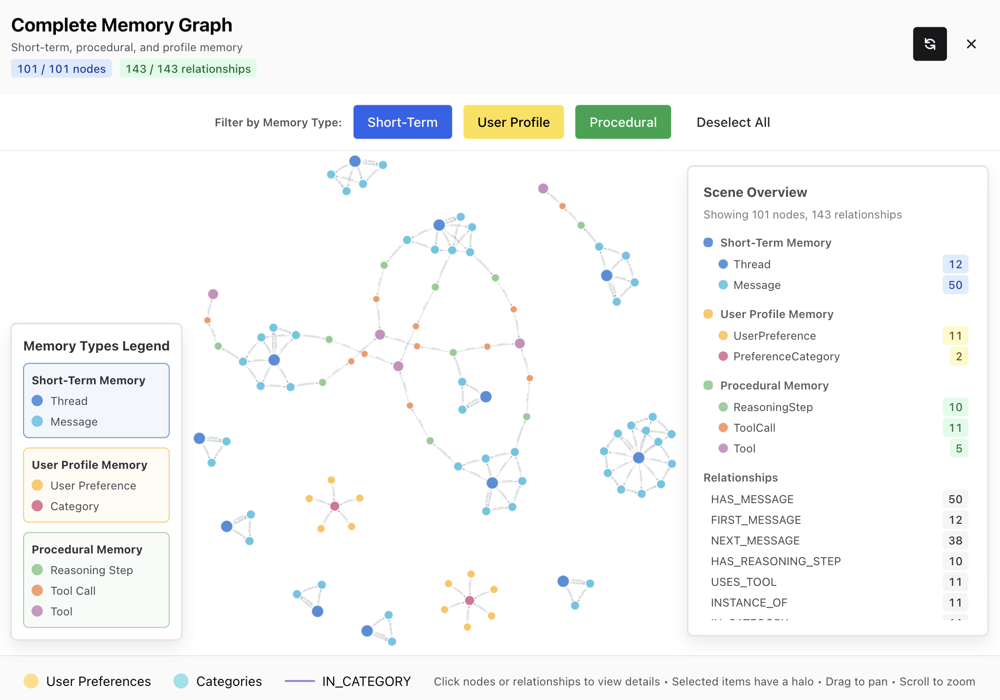
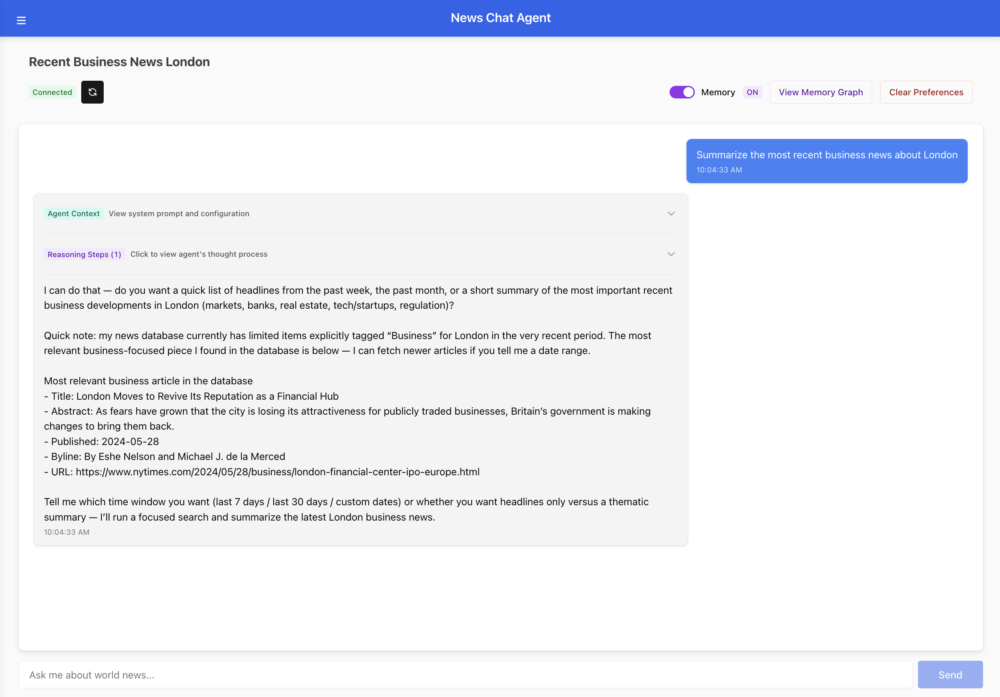
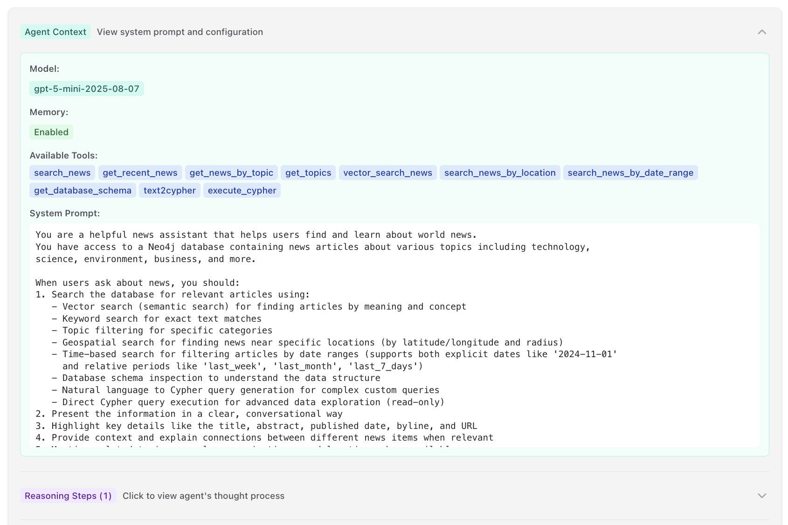
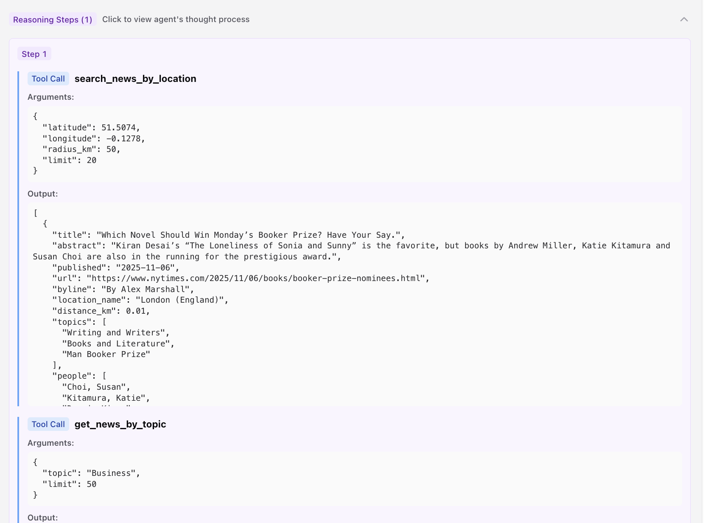
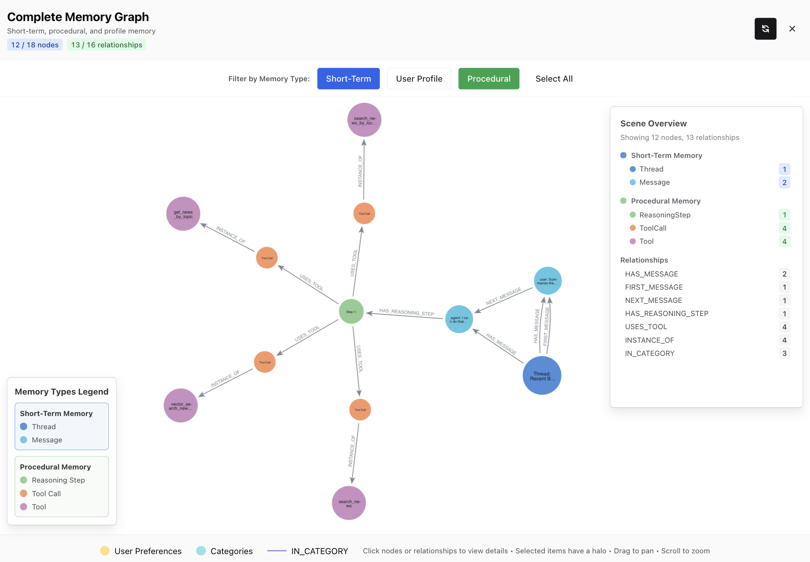
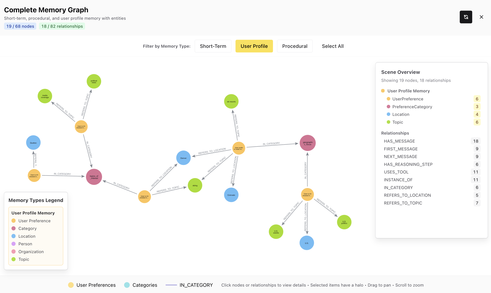

# Workshop: Building Intelligent Memory
## Graph Databases for AI Agent Context and Retrieval

Welcome to this hands-on workshop on building intelligent memory systems for AI agents using Neo4j and Pydantic AI!

[](https://codespaces.new/johnymontana/memory-graph-workshop?quickstart=1)



## Features

A full-stack chat application that uses Pydantic AI to query a Neo4j graph database of world news. The application features a modern Next.js frontend with Chakra UI and a Python FastAPI backend powered by Pydantic AI.

- 🤖 Intelligent chat agent powered by Pydantic AI and OpenAI GPT-4
- 📊 Neo4j graph database for storing and querying world news
- 🔍 **Vector Search**: Semantic search using OpenAI embeddings and Neo4j vector indexes
- 🌍 **Geospatial Search**: Find news near specific locations using latitude/longitude and radius
- 📅 **Time-Based Search**: Filter news by date ranges with support for relative periods (last_week, last_month, etc.)
- 🧠 **Memory System**: Learns and remembers user preferences from conversations
- 🗂️ **Conversation Threads**: Persistent conversation history with automatic title generation
- 🔧 **Procedural Memory**: Tracks reasoning steps, tool calls, and agent decision-making process
- 🎨 **Memory Graph Visualization**: Interactive graph view of user memory, threads, and reasoning steps using NVL
- 🛠️ **Schema Tools**: Database schema inspection, natural language to Cypher query generation, and direct Cypher execution
- 💬 Interactive chat interface built with Next.js and Chakra UI
- 🔎 Search news by topic, keywords, people, organizations, or locations
- 📰 Sample world news dataset included
- 🚀 Real-time communication between frontend and backend
- 🔄 Toggle memory on/off to control preference learning
- 🔁 Intelligent retry logic for handling empty search results

### Agent chat

Full stack app with agent chat interface.



### Inspect agent context

Detailed view of agent context for each turn including system prompt, user message, preference memory, tools available, and model used.



### Inspect reasoning steps

Detailed view of reasoning steps including tool calls, arguments, and tool call results.



### Memory graph visualization

Interactive graph visualization to inspect the memory graph.



### Episodic memory construction

Entity extraction, resolution and context management for user preferences



## Architecture

```
┌─────────────────────┐
│   Next.js Frontend  │
│   (Chakra UI)       │
└──────────┬──────────┘
           │
           │ HTTP/REST
           │
┌──────────▼──────────┐
│  FastAPI Backend    │
│  (Pydantic AI)      │
└────┬────────────┬───┘
     │            │
     │            │ (Optional)
     │            │
┌────▼─────┐  ┌──▼──────────┐
│  Neo4j   │  │   Neo4j     │
│  News    │  │   Memory    │
│  Graph   │  │  (Optional) │
└──────────┘  └─────────────┘
```

## Prerequisites

- **Python 3.10+** - Backend runtime
- **uv** - Fast Python package installer and resolver (recommended) or pip
- **Node.js 18+** - Frontend runtime
- **Neo4j 5.x** - Graph database (one instance required, two recommended for memory features)
- **OpenAI API Key** - For Pydantic AI agent and preference extraction

## Quick Start with GitHub Codespaces

The easiest way to get started is using GitHub Codespaces. Everything is pre-configured and ready to go!

1. **Open in Codespaces**
   - Click the "Code" button on GitHub
   - Select "Codespaces" tab
   - Click "Create codespace on main"

2. **Wait for automatic setup** (takes 2-3 minutes)
   - Installs `uv`, Python, Node.js, and all dependencies
   - Starts Neo4j via Docker Compose
   - Initializes sample news data

3. **Configure your API key**
   ```bash
   # Edit backend/.env and add your OpenAI API key
   OPENAI_API_KEY=your_key_here
   ```

4. **Start the application**
   ```bash
   # Terminal 1: Start backend
   make backend
   
   # Terminal 2: Start frontend
   make frontend
   ```

5. **Access the application**
   - Frontend: `http://localhost:3000`
   - Backend API: `http://localhost:8000/docs`
   - Neo4j Browser: `http://localhost:7474` (neo4j/password)

See [`.devcontainer/README.md`](./.devcontainer/README.md) for more details on the Codespaces setup.

## Installation

### 1. Neo4j Setup

Set up a second instance for memory/preferences features. The easiest way to get a Neo4j instance is to [create a free tier Neo4j Aura instance](https://console.neo4j.io). Other options:

#### Option A: Docker Compose (Recommended - includes both instances)

Use the provided `docker-compose.yml`:

```bash
# Start just the news graph instance
docker-compose up -d neo4j

# Or uncomment neo4j-memory service in docker-compose.yml and start both
docker-compose up -d
```

The memory instance (if enabled) will be available at:
- HTTP: `http://localhost:7475`
- Bolt: `bolt://localhost:7688`
- Auth: `neo4j/memorypass`

#### Option B: Docker (Manual setup for single instance)

```bash
# News graph instance (required)
docker run -d \
  --name neo4j \
  -p 7474:7474 -p 7687:7687 \
  -e NEO4J_AUTH=neo4j/password \
  neo4j:5.14

# Memory instance (optional - for preferences and threads)
docker run -d \
  --name neo4j-memory \
  -p 7475:7474 -p 7688:7687 \
  -e NEO4J_AUTH=neo4j/memorypass \
  neo4j:5.14
```

#### Option C: Neo4j Desktop

Download from [neo4j.com/download](https://neo4j.com/download/) and create one or two databases.

### 2. Backend Setup

First, install `uv` if you haven't already:
```bash
# macOS and Linux
curl -LsSf https://astral.sh/uv/install.sh | sh

# Windows
powershell -c "irm https://astral.sh/uv/install.ps1 | iex"

# Or via pip
pip install uv
```

Then set up the backend:
```bash
cd backend

# Create virtual environment and install dependencies
uv venv
source .venv/bin/activate  # On Windows: .venv\Scripts\activate

# Install dependencies from pyproject.toml
uv pip install -e .

# Or install from requirements.txt (alternative)
# uv pip install -r requirements.txt

# Configure environment variables
# Copy the example file and edit with your values:
cp .env.example .env

# Required settings:
# - NEO4J_URI=bolt://localhost:7687  # News graph instance
# - NEO4J_USERNAME=neo4j
# - NEO4J_PASSWORD=password
# - OPENAI_API_KEY=your-openai-api-key
#
# Optional settings:
# - OPENAI_MODEL=gpt-4o  # AI model to use (default: gpt-4o)
# - ENVIRONMENT=development  # Used for sample data initialization safety
#
# Optional (for memory/preferences/threads features):
# - MEMORY_NEO4J_URI=bolt://localhost:7688  # Separate instance for memory
# - MEMORY_NEO4J_USERNAME=neo4j
# - MEMORY_NEO4J_PASSWORD=memorypass
#
# Optional (CORS configuration):
# - CORS_ALLOW_ORIGINS=http://localhost:3000,https://example.com
#   (If not set, allows all origins)
#
# If MEMORY_NEO4J_URI is not set, memory, preferences, threads, and
# procedural memory features will be disabled
```

Alternatively, use `uv run` to automatically manage the virtual environment:
```bash
# Install dependencies (creates venv automatically if needed)
uv pip install -e .

# Run commands without activating venv
uv run uvicorn app.main:app --reload
```

### 3. Frontend Setup

```bash
cd frontend

# Install dependencies
npm install

# Configure environment variables
cp .env.example .env
# Default API URL is http://localhost:8000
```

## Running the Application

### Quick Start with Makefile

The project includes a Makefile with convenient commands:

```bash
# Start backend (automatically uses uv)
make backend

# Start frontend
make frontend

# Install all dependencies
make install

# Start Neo4j with Docker
make docker-up

# Initialize sample news data
make init-sample-data

# View all available commands
make help
```

### Manual Start

#### Start Backend Server

```bash
cd backend

# Option 1: Using uv run (recommended - automatically manages virtual environment)
uv run uvicorn app.main:app --reload

# Option 2: Activate virtual environment manually
source .venv/bin/activate  # On Windows: .venv\Scripts\activate
uvicorn app.main:app --reload
```

The backend will be available at `http://localhost:8000`

#### Start Frontend Development Server

```bash
cd frontend
npm run dev
```

The frontend will be available at `http://localhost:3000`

### Initialize Sample Data

Before using the application, you need to populate the news database with sample data:

```bash
# Option 1: Using Make (recommended - sets ENVIRONMENT automatically)
make init-sample-data

# Option 2: Using uv run directly
cd backend
uv run python initialize_sample_data.py

# Option 3: With activated virtual environment
cd backend
source .venv/bin/activate  # On Windows: .venv\Scripts\activate
python initialize_sample_data.py
```

**Important**: 
- This script will **delete all existing data** in the news database
- It requires `ENVIRONMENT=development` or `ENVIRONMENT=test` in your `.env` file (or set via command line)
- You'll be prompted to confirm before any data is deleted
- The Make command automatically sets the ENVIRONMENT variable

Once the sample data is initialized:

1. Open `http://localhost:3000` in your browser
2. (Optional) Enable the "Memory" toggle to activate preference learning
3. Start chatting with the news agent!

### Memory Features (Optional)

Memory features (user preferences and conversation threads) require a separate Neo4j instance. If you don't configure `MEMORY_NEO4J_URI`, these features will be automatically disabled and the application will work fine without them.

To enable memory features:
1. Set up a second Neo4j instance (see Neo4j Setup above)
2. Configure `MEMORY_NEO4J_URI`, `MEMORY_NEO4J_USERNAME`, and `MEMORY_NEO4J_PASSWORD` in your `.env` file
3. Restart the backend server

The schema will be automatically initialized when the backend starts.

## Agent Capabilities

The news agent includes several intelligent features to provide better responses:

### Intelligent Retry Logic

The agent automatically retries searches when results are empty or insufficient:
- **Automatic Retries**: Tools retry up to 3 times when returning empty results
- **Parameter Adjustments**: Automatically increases search limits on retries
- **Transparent Logging**: All retry attempts are logged and visible in the API response
- **Fallback Strategies**: Agent learns from failed attempts and adjusts its approach

### Multi-Step Reasoning

The agent can perform multi-iteration reasoning for complex queries:
- **Reasoning Iterations**: Multiple rounds of tool calls and analysis (configurable, default: 1)
- **Quality Evaluation**: Automatically evaluates if tool results are sufficient
- **Adaptive Search**: Tries different approaches when initial searches fail
- **Context Preservation**: Maintains conversation context across reasoning iterations

### Tool Selection Intelligence

The agent intelligently selects from 10 available tools based on your query:
- **Semantic Understanding**: Uses vector search for concept-based queries
- **Structured Filtering**: Uses topic/location/time filters for specific criteria
- **Schema Exploration**: Can inspect database structure for complex queries
- **Cypher Generation**: Converts natural language to Cypher for advanced data needs

### Response Features

- **Detailed Reasoning Steps**: See exactly how the agent arrived at its answer
- **Tool Call Transparency**: View all tool calls with arguments and outputs
- **Agent Context**: Inspect system prompt, model used, and available tools
- **Conversation Context**: Long thread histories are automatically summarized

## Usage Examples

Here are some questions you can ask the news agent:

**General Queries:**
- "What are the latest news?"
- "Tell me about artificial intelligence"
- "What news do you have about climate change?"
- "Show me news about space exploration"
- "What are the available news topics?"

**Time-Based Queries:**
- "Show me news from last week"
- "What happened in the last 7 days?"
- "Find articles from November 2024"

**Location-Based Queries:**
- "What news is happening near the United States?"
- "Show me news near Europe"

**Combined Queries:**
- "What's the latest news about climate change from last month?"
- "Find AI news from last week"

### Vector Search

The agent uses **semantic vector search** to find relevant articles by meaning, not just keyword matches. This allows for more intelligent and context-aware searches.

**How it works:**
1. Your query is converted to an embedding using OpenAI's text-embedding-3-small model
2. Neo4j's vector index finds the most similar articles based on cosine similarity
3. Results include a similarity score showing how relevant each article is

**Example semantic queries:**
- "Find articles about climate change impacts" - finds articles about global warming, extreme weather, environmental policy, etc.
- "What's happening with artificial intelligence?" - finds articles about AI, machine learning, neural networks, automation, etc.
- "Tell me about innovations in healthcare" - finds articles about medical technology, treatments, health research, etc.

**Benefits over keyword search:**
- Understands concepts and relationships, not just exact words
- Handles synonyms automatically
- Finds contextually related articles
- No need to craft perfect keyword queries


### Geospatial Search

Find news articles about locations within a specified distance from geographic coordinates.

**How it works:**
1. Provide latitude, longitude, and search radius in kilometers
2. Neo4j's geospatial functions find all locations within the radius
3. Returns articles related to those locations, sorted by distance
4. Uses a point index on Geo.location for optimal performance

**Example queries:**
- "What news is happening near San Francisco?" (37.7749, -122.4194)
- "Show me news within 500km of London" (51.5074, -0.1278)
- "Find news about locations near New York" (40.7128, -74.0060)

**Note**: The agent needs to know or infer coordinates for locations. In the future, this could be enhanced with a geocoding service to convert location names to coordinates automatically.

### Time-Based Search

Filter news articles by date ranges using both explicit dates and convenient relative periods.

**Supported formats:**
- **Explicit dates**: "2024-11-01", "2024-11-15"
- **Relative periods**: "today", "yesterday", "last_week", "last_month", "last_7_days", "last_30_days"

**Example queries:**
- "Show me news from last week"
- "What happened between November 1st and November 10th, 2024?"
- "Find articles from the last 7 days about climate change"
- "Get news from last month"

**How it works:**
1. Date strings are automatically parsed (both explicit and relative)
2. Articles are filtered by their published date
3. Results are sorted by publication date (newest first)


### Memory System

**Note**: Memory features require a separate Neo4j instance. If not configured, these features are automatically disabled.

When memory is enabled and the memory toggle is on, the agent will:
- Learn your preferences from conversations
- Remember topics you're interested in
- Adapt to your preferred detail level and writing style
- Store preferences globally (shared across all users)
- Maintain conversation threads/history

**Example conversation with memory enabled:**

```
User: "I prefer brief summaries and I'm mainly interested in climate change news"
Agent: [Provides brief climate change news and stores these preferences]

User: "What's new today?"
Agent: [Uses learned preferences to focus on climate change with brief summaries]
```

**Managing Preferences:**
- Click "Clear Preferences" to reset all learned preferences
- Use the API endpoint `/preferences/list` to view current preferences
- Memory toggle controls both reading and writing preferences
- Click "View Memory Graph" to see an interactive visualization of your memory

**Configuration:**
To enable memory features, set these environment variables in `.env`:
- `MEMORY_NEO4J_URI` - Connection URI for memory instance
- `MEMORY_NEO4J_USERNAME` - Username (default: neo4j)
- `MEMORY_NEO4J_PASSWORD` - Password

### Memory Graph Visualization

The application includes a powerful graph visualization feature that displays your complete memory system:

- **Interactive Graph**: View preferences, categories, threads, messages, reasoning steps, and tool calls
- **Color-Coded Nodes**: Different colors for each node type (preferences, threads, messages, reasoning steps, tools)
- **Zoom Controls**: Zoom in, out, and reset the view
- **Node Details**: Click nodes to see detailed information
- **Real-time Updates**: Refresh to see the latest memory state
- **Procedural Memory**: Visualize how the agent reasons and which tools it uses

The graph shows:
- **Declarative Memory**: User preferences and categories
- **Episodic Memory**: Conversation threads and messages
- **Procedural Memory**: Reasoning steps and tool usage patterns


### Conversation Threads

The application maintains persistent conversation threads when memory features are enabled:

- **Automatic Thread Creation**: New conversations automatically create threads
- **Thread History**: Load and continue previous conversations
- **Auto-Generated Titles**: Threads automatically receive descriptive titles after the first exchange
- **Thread Management**: List, view, update, and delete threads via API
- **Message History**: Full conversation context is preserved with reasoning steps
- **Conversation Summarization**: Long threads are automatically summarized to maintain context

### Schema Tools

Advanced database exploration tools for complex queries:

- **get_database_schema**: Inspect the complete Neo4j schema including node labels, relationships, properties, constraints, and indexes
- **text2cypher**: Convert natural language questions into Cypher queries using AI
- **execute_cypher**: Execute custom read-only Cypher queries for advanced data exploration

**Example usage:**
```
User: "What's the structure of the database?"
Agent: [Uses get_database_schema to show all node types and relationships]

User: "Show me how many articles each organization is mentioned in"
Agent: [Uses text2cypher to generate appropriate Cypher query, then execute_cypher to run it]
```


## Project Structure

```
pydantic-ai-neo4j/
├── backend/
│   ├── app/
│   │   ├── __init__.py
│   │   ├── main.py                      # FastAPI application
│   │   ├── agent.py                     # Pydantic AI agent
│   │   ├── neo4j_client.py              # Neo4j database client (news)
│   │   ├── preferences_client.py        # Neo4j preferences client
│   │   ├── sessions_client.py           # Conversation threads management
│   │   ├── procedural_memory_client.py  # Reasoning steps and tool calls
│   │   └── memory_provider.py           # Memory/preference provider
│   ├── initialize_sample_data.py        # Sample data initialization script
│   ├── pyproject.toml                   # Project configuration and dependencies (uv)
│   ├── requirements.txt                 # Legacy requirements (optional)
│   ├── setup_preferences_db.py          # Preferences database setup script
│   └── MCP_INTEGRATION.md               # MCP server integration guide
├── frontend/
│   ├── app/
│   │   ├── layout.tsx                   # Root layout
│   │   ├── page.tsx                     # Home page
│   │   └── providers.tsx                # Chakra UI provider
│   ├── components/
│   │   ├── ChatInterface.tsx            # Main chat component
│   │   ├── Sidebar.tsx                  # Conversation sidebar
│   │   └── MemoryGraphView.tsx          # Memory graph visualization
│   ├── lib/
│   │   └── api.ts                       # API client
│   ├── package.json
│   ├── tsconfig.json
│   └── .env.example
├── workshop/                             # Workshop materials and exercises
│   ├── exercises/                        # Hands-on exercises
│   │   ├── exercise1_short_term_memory.md
│   │   ├── exercise2_user_preferences.md
│   │   └── exercise3_procedural_memory.md
│   ├── slides/                           # Workshop presentation
│   └── README.md                         # Workshop guide
└── README.md
```

## API Endpoints

### Backend API

#### General
- `GET /` - Root endpoint
- `GET /health` - Health check

#### Chat
- `POST /chat` - Send message to agent
  ```json
  {
    "message": "What are the latest news?",
    "memory_enabled": false,
    "thread_id": "optional-thread-id"
  }
  ```
  Returns chat response with reasoning steps, tool calls, and agent context

#### News
- `GET /categories` - Get available news topics

#### Preferences (requires memory Neo4j instance)
- `GET /preferences/status` - Get preference statistics
- `GET /preferences/list` - List all stored preferences
- `GET /preferences/graph` - Get complete memory graph for visualization (includes preferences, threads, messages, reasoning steps, and tool calls)
- `POST /preferences/clear` - Clear all preferences
- `DELETE /preferences/{id}` - Delete a specific preference

#### Conversation Threads (requires memory Neo4j instance)
- `GET /threads` - List all conversation threads
- `GET /threads/last-active` - Get the most recently active thread
- `GET /threads/{thread_id}` - Get a specific thread with all messages
- `POST /threads` - Create a new thread
  ```json
  {
    "title": "Optional title"
  }
  ```
- `PUT /threads/{thread_id}/title` - Update thread title
  ```json
  {
    "title": "New title"
  }
  ```
- `DELETE /threads/{thread_id}` - Delete a thread and all its messages

## Neo4j Graph Schema

```cypher
(:Article {
  title: string (indexed),
  abstract: string,
  published: string (indexed),
  url: string (indexed),
  byline: string,
  embedding: list (1536-dimensional vector, indexed with article_embedding_index)
})

(:Topic {name: string (indexed)})
(:Person {name: string (indexed)})
(:Organization {name: string (indexed)})
(:Geo {
  name: string (indexed),
  location: point (indexed)
})
(:Photo {
  url: string (indexed),
  caption: string
})

(:Article)-[:HAS_TOPIC]->(:Topic)
(:Article)-[:ABOUT_PERSON]->(:Person)
(:Article)-[:ABOUT_ORGANIZATION]->(:Organization)
(:Article)-[:ABOUT_GEO]->(:Geo)
(:Article)-[:HAS_PHOTO]->(:Photo)
```

### Memory Database Schema

User preferences and conversation threads are stored in a separate Neo4j instance (if configured):

**Preferences:**
```cypher
(:UserPreference {
  id: string (unique, indexed),
  category: string (indexed),
  preference: string,
  context: string,
  confidence: float,
  created_at: datetime (indexed),
  last_updated: datetime
})

(:PreferenceCategory {
  name: string (unique),
  description: string
})

(:UserPreference)-[:IN_CATEGORY]->(:PreferenceCategory)
```

**Conversation Threads:**
```cypher
(:Thread {
  id: string (unique, indexed),
  title: string,
  created_at: datetime,
  updated_at: datetime,
  last_message_at: datetime (indexed)
})

(:Message {
  id: string (unique, indexed),
  thread_id: string (indexed),
  text: string,
  sender: string,
  timestamp: datetime (indexed),
  reasoning_steps: string (JSON),
  agent_context: string (JSON)
})

// Thread relationships
(:Thread)-[:HAS_MESSAGE]->(:Message)
(:Thread)-[:FIRST_MESSAGE]->(:Message)
(:Message)-[:NEXT_MESSAGE]->(:Message)
```

**Procedural Memory (Reasoning Steps and Tool Calls):**
```cypher
(:ReasoningStep {
  id: string (unique, indexed),
  step_number: integer,
  reasoning_text: string,
  timestamp: datetime,
  message_id: string (indexed),
  thread_id: string (indexed)
})

(:ToolCall {
  id: string (unique, indexed),
  step_id: string (indexed),
  timestamp: datetime,
  arguments: string (JSON),
  output: string (JSON)
})

(:Tool {
  name: string (unique),
  description: string,
  created_at: datetime,
  last_used_at: datetime,
  usage_count: integer
})

// Procedural memory relationships
(:Message)-[:HAS_REASONING_STEP]->(:ReasoningStep)
(:ReasoningStep)-[:NEXT_STEP]->(:ReasoningStep)
(:ReasoningStep)-[:USES_TOOL]->(:ToolCall)
(:ToolCall)-[:INSTANCE_OF]->(:Tool)
```

**Preference Categories:**
- `topics_of_interest` - News topics the user is interested in
- `detail_level` - Preferred level of detail (brief, detailed, etc.)
- `writing_style` - Preferred communication style
- `topic_dislikes` - Topics to avoid or minimize
- `geographic_focus` - Geographic regions of interest
- `news_sources` - Preferred news sources
- `other` - Other user preferences

## Development

### Backend Development

The backend uses:
- **FastAPI** - Modern web framework
- **Pydantic AI** - AI agent framework
- **Neo4j Python Driver** - Database connectivity

To add new agent capabilities, edit `backend/app/agent.py` and add new tool functions.

### Frontend Development

The frontend uses:
- **Next.js 14** - React framework with App Router
- **Chakra UI** - Component library
- **TypeScript** - Type safety

To modify the UI, edit components in `frontend/components/`.

## Troubleshooting

### Backend won't start
- Ensure Python 3.10+ is installed
- Install `uv` if using it: `curl -LsSf https://astral.sh/uv/install.sh | sh`
- Check that all dependencies are installed: `uv pip install -e .`
- Verify your `.env` file has correct credentials

### Frontend shows "Disconnected"
- Ensure the backend server is running on port 8000
- Check that CORS is properly configured in `backend/app/main.py`
- Verify the API URL in `frontend/.env`

### Neo4j connection fails
- Ensure Neo4j is running
- Verify connection details in `backend/.env`
- Check that the Neo4j bolt port (7687) is accessible

### Agent responses are slow
- OpenAI API calls may take a few seconds
- Check your internet connection
- Verify your OpenAI API key is valid
- When memory is enabled, preference extraction adds a small overhead

### Memory/Preferences not working
- Check if `MEMORY_NEO4J_URI` is set in your `.env` file
- Ensure the memory Neo4j instance is running and accessible
- Verify the credentials (`MEMORY_NEO4J_USERNAME` and `MEMORY_NEO4J_PASSWORD`)
- Look for initialization messages in the backend console
- If memory features are not needed, simply don't set `MEMORY_NEO4J_URI`

## Technologies Used

### Backend
- Python 3.10+
- FastAPI - Modern web framework
- Pydantic AI - AI agent framework
- Neo4j Python Driver 5.14.1
- OpenAI API (configurable model, defaults to GPT-4o)
- uv - Fast Python package installer and resolver

### Frontend
- Next.js 14 - React framework with App Router
- React 18
- TypeScript
- Chakra UI v3 - Component library
- NVL - Graph visualization

### Database
- Neo4j 5.x (5.14.0 recommended)
- Separate instances supported for news data and memory

## Workshop Materials

The `workshop/` directory contains:

- **Hands-on Exercises**: Step-by-step exercises covering:
  - Exercise 1: Short-term memory with Pydantic AI
  - Exercise 2: User preferences and semantic memory
  - Exercise 3: Procedural memory and reasoning steps
  
- **Workshop Guide**: Complete guide with setup instructions, concepts, and exercises
- **Presentation Slides**: Workshop presentation materials

See [workshop/README.md](./workshop/README.md) for the complete workshop guide.


## License

MIT

## Contributing

Contributions are welcome! Please feel free to submit a Pull Request.
